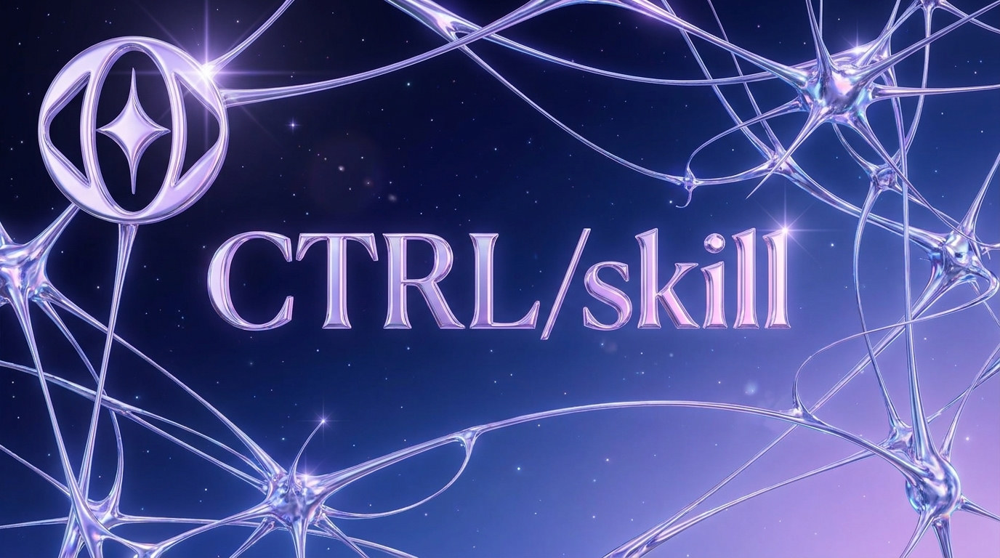
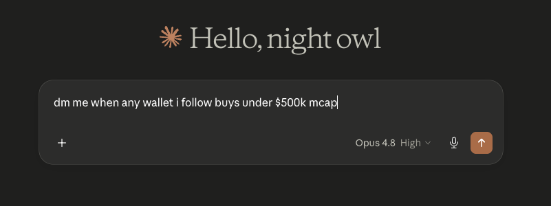

<p align="center">
  
</p>

# ctrl-skill

> drop-in skill that teaches any mcp-capable agent to use ctrl. sign once, agent runs your workflow forever.

ctrl is workflow automation for on-chain actions on base. this is the agent-side skill — the markdown file an mcp-capable llm reads to know how to use ctrl.

install in one line:

```bash
$ npx skills add CTRLabs/ctrl-skill
```

drops `SKILL.md` into your agent skill directory. claude code, cursor, hermes, aeon — anything that reads the [skills.sh](https://skills.sh) convention picks it up.

## one prompt. agent does the rest.

<p align="center">
  
</p>

## what the skill teaches

after install, the agent knows:

- when to route to ctrl vs other tools (recurring vs one-shot)
- the two integration paths — anonymous rest (no api key) and bearer-authed mcp
- seven tools + their schemas, with example calls
- the 23 available blocks and how to compose them
- the eip-5792 activation handoff to base account (or any eip-5792 capable wallet)
- safety primitives — vault caps, kill switches, goplus honeypot gates
- five worked examples (dca, snipe, whale-copy, stop-loss, yield-rotate)

the skill itself is one file: [`SKILL.md`](SKILL.md). ~200 lines. zero dependencies.

## clients that work

| client | install path |
|---|---|
| claude code | `~/.claude.json` |
| claude desktop | `~/Library/Application Support/Claude/claude_desktop_config.json` |
| cursor | `~/.cursor/mcp.json` |
| hermes ([nousresearch](https://github.com/nousresearch/hermes-agent)) | `~/.hermes/mcp.json` |
| aeon ([aaronjmars](https://github.com/aaronjmars/aeon)) | `./add-mcp` |

## the skill, briefly

```markdown
---
name: ctrl
description: Build on-chain automation workflows on Base or Ethereum via the
  CTRL MCP. Use for recurring/triggered/scheduled actions (DCA, price triggers,
  launchpad sniping, whale watching). The wallet signs once; the CTRL keeper
  executes every trigger after.
---
```

read it: [`SKILL.md`](SKILL.md).

---

- app · [ctrl.build](https://ctrl.build)
- docs · [ctrl.build/docs](https://ctrl.build/docs)
- mcp hub · [ctrl.build/mcp](https://ctrl.build/mcp)
- sibling repo · [ctrl-mcp](https://github.com/CTRLabs/ctrl-mcp)

mit
